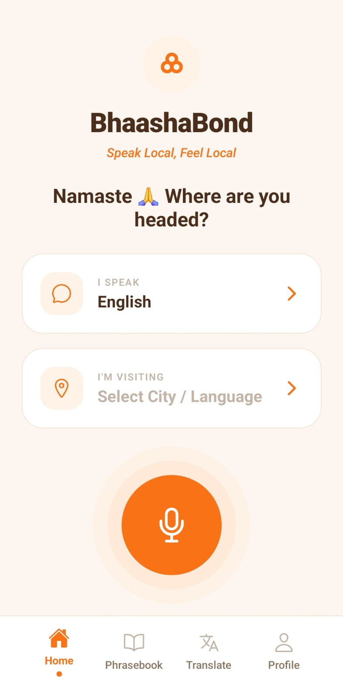

# BhashaBond 🌍

**Speak Local, Feel Local** — A travel-first translation app for India, supporting all 22 scheduled Indian languages + English with real-time translation, curated travel phrasebooks, city guides, and pronunciation assistance.



---

## ✨ Features

### 🗣️ Real-Time Translation
Translate any phrase between **24 languages** instantly. Type or speak — get accurate translations with romanized pronunciation guides so you can read and speak any Indian script confidently.

### 📚 Travel Phrasebook
Curated, ready-to-use phrases across **4 categories** — Food, Travel, Emergency, and Shopping — each with native script translations and pronunciation for the most widely spoken Indian languages.

### 🏙️ City Guides
Pick your destination from **20+ major Indian cities** and get local food recommendations, must-visit tourist spots, and city-specific travel tips — all with photos.

### 🚨 Emergency Toolkit
One-tap access to India's emergency numbers (112, 100, 101, 102), women's helpline (1091), tourist helpline (1363), and a safety phrase card with instant dial support.

### 🎙️ Voice Input & Audio Playback
Speak into the mic to translate hands-free. Tap any translation to hear it spoken aloud with adjustable pronunciation speed.

### 📌 Save & Copy
Bookmark translations to your personal phrasebook (up to 200 saved) and copy translations with a single tap.

### 🗺️ State & Region Picker
Select your destination by **Indian state or union territory** (all 28 states + 8 UTs covered). The app automatically maps your destination to the local language and nearest major city guide.

### 🌗 Dark & Light Mode
Full dark mode support with a polished warm-tone design system.

### 🔐 Secure Authentication
Google OAuth sign-in powered by Clerk — your account, synced and secure.

---

## 🌐 Supported Languages

| | | | |
|:---|:---|:---|:---|
| English | Hindi | Bengali | Telugu |
| Marathi | Tamil | Gujarati | Kannada |
| Malayalam | Punjabi | Odia | Assamese |
| Maithili | Urdu | Sindhi | Konkani |
| Nepali | Manipuri | Bodo | Sanskrit |
| Kashmiri | Dogri | Santali | |

---

## 🏗️ Tech Stack

| Layer | Technology |
|:---|:---|
| **Frontend** | React Native (Expo SDK 54) |
| **Auth** | Clerk (Google OAuth SSO) |
| **Backend** | FastAPI (Python) |
| **Translation** | Google Translate API / Gemini API |
| **Hosting** | Render |

---

## 🚀 Getting Started

### Prerequisites

- Node.js 18+
- npm or yarn
- Expo CLI
- Android Studio or Xcode

### 1. Clone & Install

```bash
git clone https://github.com/dhruvil0203/Bhashabond.git
cd BhashaBond
npm install
```

### 2. Configure Environment

```bash
cp .env.example .env
```

Edit `.env`:
```env
EXPO_PUBLIC_CLERK_PUBLISHABLE_KEY=your_clerk_key
EXPO_PUBLIC_API_URL=https://bhashabond-api.onrender.com
```

### 3. Run

```bash
npm start
```

```bash
# Android
npm run android

# iOS
npm run ios
```

---

## ⚙️ Backend Setup

The production backend is live at `https://bhashabond-api.onrender.com`

To run your own instance:

```bash
cd backend
pip install -r requirements.txt
```

Create `backend/.env`:
```env
GOOGLE_TRANSLATE_API_KEY=your_google_api_key   # Optional — free endpoint used as fallback
GEMINI_API_KEY=your_gemini_api_key             # Optional — free via aistudio.google.com
```

```bash
uvicorn main:app --host 0.0.0.0 --port 8000 --reload
```

To deploy on Render, connect the repository — `render.yaml` handles the rest.

See [DEPLOYMENT_GUIDE.md](DEPLOYMENT_GUIDE.md) for detailed instructions.

---

## 📦 Build APK

```bash
npm install -g eas-cli
eas login
eas build --platform android --profile preview
```

---

## 📁 Project Structure

```
BhashaBond/
├── App.js                # Entry point — auth gate, navigation, tab bar
├── screens/
│   ├── HomeScreen.js          # Landing — language picker, mic button
│   ├── TranslatorScreen.js    # Core translator with text/voice input
│   ├── PhrasebookScreen.js    # Travel phrasebook & city guides
│   ├── LanguagePickerScreen.js # State/region-based language selector
│   ├── ProfileScreen.js       # Settings, saved phrases, sign out
│   ├── SignInScreen.js        # Google OAuth sign-in
│   ├── cityGuideData.js       # City food & tourist spot data
│   ├── phrasebookGuideData.js # Emergency numbers, festival greetings
│   └── shoppingData.js        # Shopping area data
├── services/
│   ├── translator.js      # Translation engine & API integration
│   └── romanizer.js       # Indian script → Latin romanization
├── context/
│   └── ThemeContext.js    # Dark/Light mode provider
├── theme/
│   └── colors.js          # Design tokens
├── backend/
│   ├── main.py            # FastAPI app
│   ├── routers/
│   │   ├── translate.py   # Translation endpoint (Google/Gemini)
│   │   ├── languages.py   # Language metadata
│   │   ├── phrasebook.py  # Phrasebook API
│   │   └── history.py     # Translation history
│   └── requirements.txt
└── assets/                # Icons, splash screen
```

---

## 💰 Cost Estimation

| Tier | Render | Translation API | Total |
|:---|:---|:---|:---|
| **Free** | Free (cold starts) | Free endpoint | **$0/month** |
| **Production** | $7/month (always-on) | ~$20/month | **~$27/month** |

---

## 🗺️ Roadmap

- [ ] IndicTrans2 on-device ML model integration
- [ ] Downloadable language packs
- [ ] Community-contributed phrases
- [ ] Progressive Web App version
- [ ] iOS optimization

---

## 🤝 Contributing

Contributions are welcome! Please feel free to submit a Pull Request.

## 📄 License

MIT License — see [LICENSE](LICENSE) for details.

## 🙏 Acknowledgments

- [Google Translate API](https://cloud.google.com/translate) & [Gemini API](https://aistudio.google.com/)
- [Expo](https://expo.dev/) — React Native framework
- [Clerk](https://clerk.com/) — Authentication
- [Render](https://render.com/) — Backend hosting

---

**Made with ❤️ for breaking language barriers in India**
